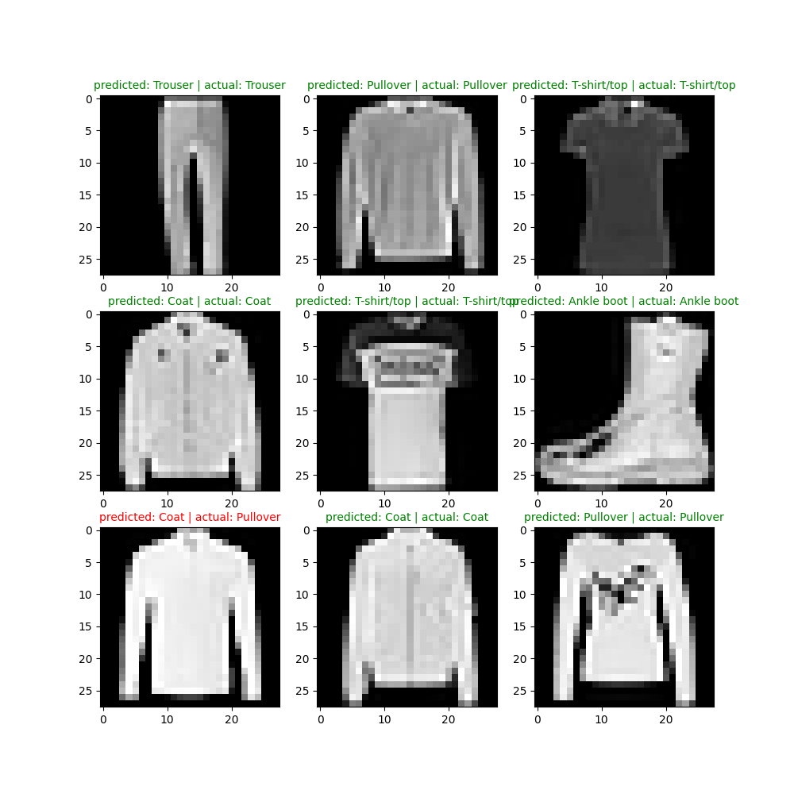
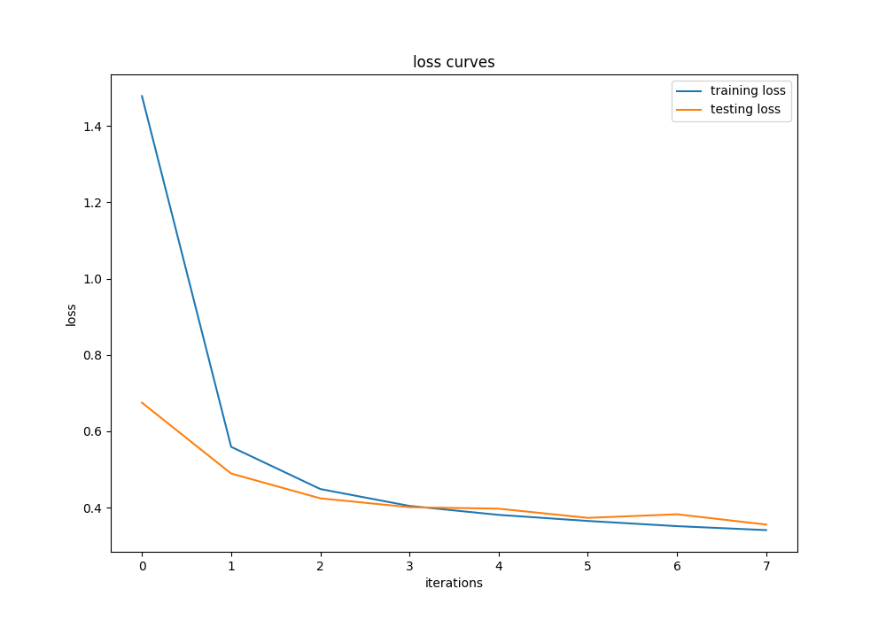
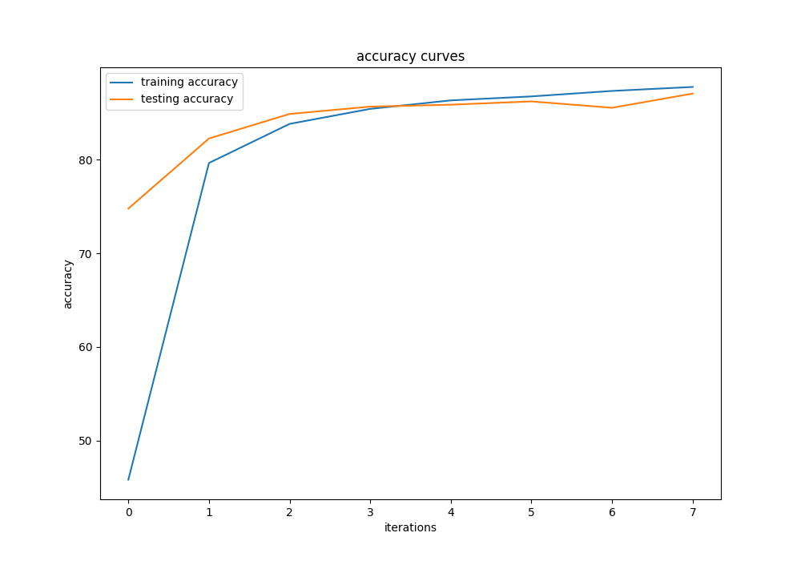

# Basic-Multiclass-Classification-Convolutional-Neural-Network
A basic multiclass classification convolutional neural network using PyTorch

# Dependencies
- pytorch
- matplotlib
- mlxtend
- torchmetrics
- tqdm

# Command to run the model
```bash
python main.py
```

# Results



 
